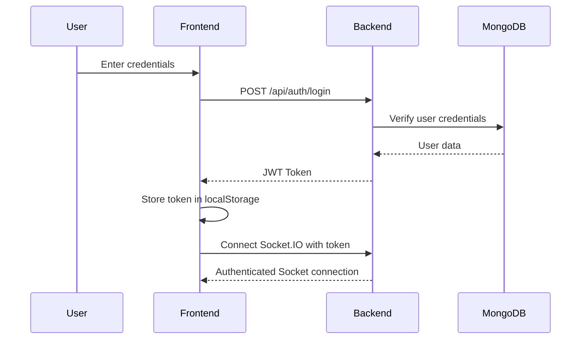

<div align="center">

# 💬 MERN Real-Time Chat Application

[](https://opensource.org/licenses/MIT)
[](https://nodejs.org/)
[](https://reactjs.org/)
[](https://www.mongodb.com/)
[](https://socket.io/)

**A modern, scalable real-time chat platform built with the MERN stack**

[Live Demo](https://real-time-chat-application-two-smoky.vercel.app) • [Report Bug](https://github.com/Sarth00718/Real-Time-Chat-Application/issues) • [Request Feature](https://github.com/Sarth00718/Real-Time-Chat-Application/issues)

</div>

## Features

## 🌟 Overview

A production-ready real-time chat application featuring **WebSocket-based instant messaging**, secure **JWT authentication**, and a sleek, responsive interface. Built to handle concurrent users with real-time updates, typing indicators, and message persistence.

### 🎯 Key Highlights

✨ **Real-Time Communication** - Bidirectional WebSocket messaging via Socket.IO  
🔐 **Secure Authentication** - JWT-based user authentication with bcrypt password hashing  
📱 **Fully Responsive** - Mobile-first design built with Tailwind CSS  
⚡ **State Management** - Redux Toolkit for predictable state updates  
💾 **Data Persistence** - MongoDB Atlas for reliable message storage  
🎨 **Modern UI/UX** - Clean interface with typing indicators and read receipts

## 🌐 Live Deployment

| Service | URL | Status |
|---------|-----|--------|
| 🌐 Frontend | [Vercel Deployment](https://real-time-chat-application-eosin.vercel.app) | ✅ Live |
| 🔧 Backend API | [Render Deployment](https://real-time-chat-application-hwsq.onrender.com) | ✅ Live |

> **Note**: Backend on Render free tier may take 30-60 seconds to wake up from sleep on first request.

### Quick Links
- 📚 [Deployment Guide](./DEPLOYMENT.md) - Complete deployment instructions
- ✅ [Deployment Checklist](./DEPLOYMENT_CHECKLIST.md) - Step-by-step checklist

## 🎥 Demo & Screenshots

> 💡 **Tip**: Add screenshots or GIFs of your application here to showcase its features visually.

```
[Login Screen]  [Chat Interface]  [Mobile View]
```

### Development Mode

## 🚀 Features

### 👤 User Features
- 📝 User registration and login with email validation
- 💬 Real-time one-on-one messaging
- 👥 View online/offline user status
- ⌨️ Live typing indicators
- ✅ Message read receipts
- 🕒 Message timestamps
- 🔔 Real-time notifications
- 🔄 Auto-reconnection on network disruption

### 🔐 Security Features
- 🔒 Password encryption with bcrypt
- 🎫 JWT token-based authentication
- 🛡️ Protected API routes
- 🔑 Secure session management
- 🚫 CORS configuration

### 🎨 UI/UX Features
- 🌓 Clean, modern interface
- 📱 Fully responsive design
- ⚡ Smooth animations and transitions
- 🎯 Intuitive user experience
- 💬 Message history scrolling

## 🛠️ Tech Stack

<table>
<tr>
<td valign="top" width="50%">

### 🎨 Frontend
- ⚛️ **React 18.x** - UI library
- 🔄 **Redux Toolkit** - State management
- 🎨 **Tailwind CSS** - Styling framework
- 🔌 **Socket.IO Client** - WebSocket client
- 🚀 **Vite** - Build tool & dev server
- 📱 **React Router** - Navigation

</td>
<td valign="top" width="50%">

### ⚙️ Backend
- 🟢 **Node.js** - Runtime environment
- 🚂 **Express.js** - Web framework
- 🔌 **Socket.IO** - WebSocket server
- 🍃 **MongoDB** - NoSQL database
- 🔗 **Mongoose** - ODM library
- 🔐 **JWT** - Authentication
- 🔒 **bcrypt** - Password hashing

</td>
</tr>
</table>

## 📂 Project Structure

```
Real-Time-Chat-Application/
├── frontend/                 # React frontend application
│   ├── src/
│   │   ├── components/      # Reusable UI components
│   │   ├── pages/           # Application pages
│   │   ├── store/           # Redux store & slices
│   │   ├── utils/           # Helper functions
│   │   ├── hooks/           # Custom React hooks
│   │   ├── App.jsx          # Root component
│   │   └── main.jsx         # Entry point
│   ├── public/              # Static assets
│   └── package.json
│
├── backend/                  # Node.js backend API
│   ├── config/              # Configuration files
│   ├── controllers/         # Request handlers
│   ├── middlewares/         # Custom middleware
│   ├── models/              # Mongoose schemas
│   ├── routes/              # API routes
│   ├── socket/              # Socket.IO handlers
│   ├── utils/               # Utility functions
│   ├── index.js             # Server entry point
│   └── package.json
│
└── README.md
```

---

## 🏁 Getting Started

### 📋 Prerequisites

Before you begin, ensure you have the following installed:

- **Node.js** (v16.x or higher) - [Download](https://nodejs.org/)
- **npm** or **yarn** - Comes with Node.js
- **MongoDB Atlas Account** - [Sign Up](https://www.mongodb.com/cloud/atlas)
- **Git** - [Download](https://git-scm.com/)

### 📦 Installation

#### 1️⃣ Clone the Repository

```bash
git clone https://github.com/Sarth00718/Real-Time-Chat-Application.git
cd Real-Time-Chat-Application
```

#### 2️⃣ Backend Setup

```bash
# Navigate to backend directory
cd backend

# Install dependencies
npm install

# Create .env file
touch .env
```

Add the following environment variables to `.env`:

```env
# Server Configuration
PORT=3000
NODE_ENV=development

# Database
MONGO_URI=mongodb+srv://<username>:<password>@cluster0.mongodb.net/chatapp?retryWrites=true&w=majority

# JWT Secret
JWT_SECRET=your_super_secret_jwt_key_here_change_in_production

# Frontend URL (for CORS)
FRONTEND_URL=http://localhost:5173
```

```bash
# Start the backend server
npm run dev
```

Backend will run on `http://localhost:3000`

#### 3️⃣ Frontend Setup

Open a **new terminal** window:

```bash
# Navigate to frontend directory
cd frontend

# Install dependencies
npm install

# Create .env file
touch .env
```

Add the following to frontend `.env`:

```env
VITE_API_URL=http://localhost:3000
VITE_SOCKET_URL=http://localhost:3000
```

```bash
# Start the frontend development server
npm run dev
```

Frontend will run on `http://localhost:5173`

---

## 🎮 Usage

1. **Open your browser** and navigate to `http://localhost:5173`
2. **Register** a new account or **login** with existing credentials
3. **Start chatting** with other registered users in real-time
4. **Experience** typing indicators, read receipts, and instant message delivery

### 🧪 Testing with Multiple Users

To test real-time functionality:
- Open the app in **multiple browser windows** or **incognito tabs**
- Register/login with **different accounts** in each window
- Send messages and observe **real-time updates** across all windows

---

## 🔒 Authentication Flow



---

## 🔌 Socket.IO Events

### Client → Server

| Event | Description | Payload |
|-------|-------------|---------|
| `setup` | Initialize user socket | `{ userId }` |
| `join_chat` | Join a chat room | `{ chatId }` |
| `send_message` | Send a new message | `{ message, chatId, userId }` |
| `typing` | User started typing | `{ chatId, userId }` |
| `stop_typing` | User stopped typing | `{ chatId, userId }` |
| `disconnect` | User disconnected | - |

### Server → Client

| Event | Description | Payload |
|-------|-------------|---------|
| `message_received` | New message received | `{ message }` |
| `typing` | Show typing indicator | `{ userId, chatId }` |
| `stop_typing` | Hide typing indicator | `{ userId, chatId }` |
| `user_online` | User came online | `{ userId }` |
| `user_offline` | User went offline | `{ userId }` |

---

## 🔧 API Endpoints

### Authentication

```http
POST   /api/auth/register     # Register new user
POST   /api/auth/login        # User login
GET    /api/auth/me           # Get current user (protected)
POST   /api/auth/logout       # User logout
```

### Users

```http
GET    /api/users             # Get all users (protected)
GET    /api/users/:id         # Get user by ID (protected)
GET    /api/users/search?q=   # Search users (protected)
```

### Messages

```http
GET    /api/messages/:chatId  # Get all messages for a chat (protected)
POST   /api/messages          # Send a new message (protected)
DELETE /api/messages/:id      # Delete a message (protected)
```

### Chats

```http
GET    /api/chats             # Get all chats for user (protected)
POST   /api/chats             # Create or get one-on-one chat (protected)
```

---

## 🐛 Troubleshooting

<details>
<summary><b>MongoDB Connection Issues</b></summary>

- ✅ Verify your MongoDB Atlas cluster is running
- ✅ Check your IP address is whitelisted in MongoDB Atlas
- ✅ Ensure `MONGO_URI` is correctly formatted in `.env`
- ✅ Confirm network connectivity to MongoDB Atlas

```bash
# Test MongoDB connection
node -e "const mongoose = require('mongoose'); mongoose.connect(process.env.MONGO_URI).then(() => console.log('Connected!')).catch(err => console.error(err));"
```
</details>

<details>
<summary><b>Socket.IO Connection Problems</b></summary>

- ✅ Ensure backend server is running on the correct port
- ✅ Check CORS settings in `backend/index.js`
- ✅ Verify `VITE_SOCKET_URL` in frontend `.env` matches backend URL
- ✅ Open browser console to check for WebSocket errors

```javascript
// Check Socket.IO connection in browser console
socket.on('connect', () => console.log('Connected:', socket.id));
socket.on('connect_error', (err) => console.error('Connection Error:', err));
```
</details>

<details>
<summary><b>JWT Authentication Errors</b></summary>

- ✅ Ensure `JWT_SECRET` is set in backend `.env`
- ✅ Check token is being stored in localStorage
- ✅ Verify token is being sent in Authorization header
- ✅ Clear browser localStorage and re-login

```bash
# Clear localStorage in browser console
localStorage.clear();
```
</details>

<details>
<summary><b>Port Already in Use</b></summary>

If you see `EADDRINUSE` error:

```bash
# Find and kill process using port 3000 (macOS/Linux)
lsof -ti:3000 | xargs kill -9

# Find and kill process using port 3000 (Windows)
netstat -ano | findstr :3000
taskkill /PID <PID> /F
```
</details>

<details>
<summary><b>Build Errors</b></summary>

- ✅ Delete `node_modules` and reinstall: `rm -rf node_modules && npm install`
- ✅ Clear npm cache: `npm cache clean --force`
- ✅ Ensure Node.js version is 16.x or higher: `node --version`
</details>

---

## 🚀 Deployment

### Deploy Backend (Render)

1. Create a new **Web Service** on [Render](https://render.com)
2. Connect your GitHub repository
3. Set **Build Command**: `npm install`
4. Set **Start Command**: `npm start`
5. Add environment variables from your `.env` file
6. Deploy and copy the service URL

### Deploy Frontend (Vercel)

1. Install Vercel CLI: `npm install -g vercel`
2. Navigate to frontend directory: `cd frontend`
3. Run: `vercel`
4. Follow the prompts to deploy
5. Update `VITE_API_URL` and `VITE_SOCKET_URL` to point to your deployed backend

### Deploy Database (MongoDB Atlas)

MongoDB Atlas is already cloud-based, but ensure:
- IP Whitelist includes `0.0.0.0/0` (or specific IPs)
- Database user has read/write permissions
- Connection string is updated in backend `.env`

---

## 🎯 Future Enhancements

- [ ] 👥 Group chat functionality
- [ ] 📎 File and image sharing
- [ ] 🎤 Voice messages
- [ ] 📹 Video calling
- [ ] 🌙 Dark mode toggle
- [ ] 🔍 Message search
- [ ] 📌 Pin important messages
- [ ] 🎨 Custom themes
- [ ] 🌍 Multiple language support
- [ ] 📊 Message analytics
- [ ] 🔔 Push notifications
- [ ] 📱 Native mobile app (React Native)

---

## 🤝 Contributing

Contributions are what make the open-source community such an amazing place to learn, inspire, and create. Any contributions you make are **greatly appreciated**.

1. **Fork** the Project
2. Create your Feature Branch (`git checkout -b feature/AmazingFeature`)
3. Commit your Changes (`git commit -m 'Add some AmazingFeature'`)
4. Push to the Branch (`git push origin feature/AmazingFeature`)
5. Open a **Pull Request**

---

## 👨‍💻 Developer

<table>
<tr>
<td align="center">

<br />
<sub><b>Sarth Narola</b></sub>
<br />
<a href="https://github.com/Sarth00718">💻 GitHub</a> •
<a href="https://www.linkedin.com/in/sarth-narola-223002323/">💼 LinkedIn</a>
<br />
📍 Surat, Gujarat, India
<br />
📧 sarthnarola007@gmail.com
</td>
</tr>
</table>

---

## 📄 License

This project is licensed under the **MIT License** - see the [LICENSE](LICENSE) file for details.

---

## 🙏 Acknowledgments

- [Socket.IO Documentation](https://socket.io/docs/)
- [MongoDB University](https://university.mongodb.com/)
- [React Documentation](https://react.dev/)
- [Tailwind CSS](https://tailwindcss.com/)
- [Redux Toolkit](https://redux-toolkit.js.org/)

---

<div align="center">

### ⭐ If you found this project helpful, please give it a star!

**Made with ❤️ by [Sarth Narola](https://github.com/Sarth00718)**

[⬆ Back to Top](#-mern-real-time-chat-application)

</div>
